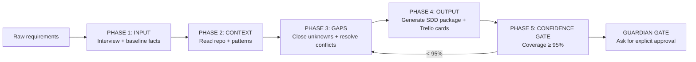
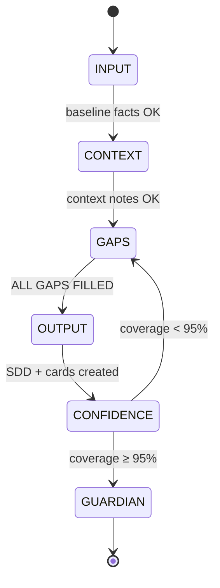

# SDD Flow One‑File Manual (v3.1)

**Updated:** 2026-02-09 (local time; use **MSK** if you record timestamps)

This is a **single-file operational runbook** for the SDD Flow in this repository.
It explains the pipeline step‑by‑step (for an AI agent and for humans), and embeds the source docs (`START.md` and `FLOW/*.md`) verbatim at the end.

---

## Quick Start (one screen)

### Pipeline at a glance



### One-line progress bar (works everywhere)

`[INPUT] → [CONTEXT] → [GAPS] → [OUTPUT] → [CONFIDENCE] → [GUARDIAN]`

### Gate loop (why you sometimes go backwards)



### Progress HUD (tick as you go)

- [ ] Phase 1 — INPUT done
- [ ] Phase 2 — CONTEXT done
- [ ] Phase 3 — GAPS done (**ALL GAPS FILLED**)
- [ ] Phase 4 — OUTPUT done (SDD package + Trello cards exist)
- [ ] Phase 5 — CONFIDENCE done (≥ 95% coverage)
- [ ] Guardian Gate passed (explicit user approval to implement)

### What you need to start

- A raw requirement dump from the user (messy is fine).
- If your interview harness/tool exists (e.g., `AskUserQuestionTool`), you must use it.

### What you will have at the end

- A complete SDD package: `docs/sdd/<task-name>-sdd/`
- Executable Trello cards: `docs/sdd/<task-name>-sdd/trello-cards/01-*.md ... NN-*.md`

---

## Global rules (read once)

### 1) Planning only

- This flow produces **documents and Trello cards only**.
- Do **not** implement or modify project code during this flow.

### 2) Documentation-first (project context)

When gathering context about the target project:

1. If `.qoder/repowiki/en/` exists, start there (but verify against actual repo files).
2. Else: `README.md` → `docs/` → other `.md` → code structure.

### 3) Minimal interview (ask only what is missing)

- Ask only **critical** questions needed to make requirements unambiguous.
- If there is a conflict, highlight it and ask for a decision.
- Optional gaps can be auto-filled only at very high confidence and must be confirmed.

### 4) Interview output constraints

When asking interview questions:

- **No tables**.
- Use a numbered list (options 1–6).
- Do not mention the word “format” in the preferences question.
- Use Russian by default if you are following the base flow as written.

### 5) Gates are real stop conditions

- Do not proceed to the next phase if the current phase gate is not satisfied.
- After Phase 4 + Phase 5, you must stop at the Guardian Gate and request explicit approval.

### 6) Optional: structured progress logging (JSON)

If you want machine-readable progress updates, keep a small JSON blob like:

```json
{"phase":"gaps","status":"in_progress","open_gaps":3,"updated_msk":"YYYY-MM-DDTHH:mm+03:00"}
```

---

## Phase 1 — INPUT (raw requirements + interview)

### Goal
Turn raw, messy input into a **complete and askable** requirements set.

### Inputs
- Raw requirements (from user).

### Steps (Checklist)

1. Ask the user to paste raw requirements (unstructured is OK).
2. Ask interview preferences (pace + up2u mode).
3. Extract baseline facts and ask only what’s missing/conflicting:
   - Problem statement
   - Target users/roles
   - Desired outcomes (top 3)
   - Deadline/timeline
   - Constraints (tech/budget/compliance)
4. Build and maintain an **Open Questions** list with IDs `GAP-001`, `GAP-002`, …
5. Record what you have into `raw-requirements.md` (working draft).

### Outputs (Artifacts)
- `raw-requirements.md` (draft)
- Open Questions list (GAP IDs)

### Gate (must be true to proceed)
- Baseline facts are present and consistent.
- All remaining unknowns are written as explicit GAP questions.

### Common mistakes
- Asking 20+ questions before writing down what you already know.
- Not assigning stable `GAP-xxx` IDs (you lose track fast).
- Mentioning “format” in the preferences question (the flow forbids it).

### Example prompts (short)

```text
Paste your raw requirements (messy is fine). Include constraints, target users, and examples if you have them.
```

```text
Before we start: do you want one question at a time or a batch? Also choose up2u mode (none / this question / all remaining).
```

### A single “gap question” template (copy/paste)

Context: …
Goal: …
Why this question: …
Progress: 3/9

Question: …
Simplified: …

1) Suggested (Recommended): …
2) …
3) …
4) Other: (free text)
5) up2u: accept suggested for this question
6) up2u all: accept suggested for all remaining questions

---

## Phase 2 — CONTEXT (project reality)

### Goal
Understand the target project’s **existing structure and conventions** so your SDD matches reality.

### Inputs
- Target repo/docs.

### Steps (Checklist)

1. Check for `.qoder/repowiki/en/` and read it first if present.
2. Read `README.md`, `docs/`, and any architecture/design docs.
3. Identify:
   - Existing components and responsibilities
   - Naming conventions and file layout
   - Existing config/env conventions
   - Existing error handling and logging patterns
   - Existing testing strategy
4. Write a concise summary to `project-context.md`.

### Outputs (Artifacts)
- `project-context.md`

### Gate (must be true to proceed)
- You can describe how the feature should fit into the project without guessing basic architecture.

### Common mistakes
- Skipping the project’s conventions and inventing a new architecture.
- Copying outdated wiki notes without verifying against repo files.
- Missing existing SDD folders under `docs/sdd/` and duplicating work.

### Example prompts (short)

```text
I will now read README/docs and map current components, constraints, and conventions. I will write a concise project-context.md.
```

---

## Phase 3 — GAPS (normalize + close unknowns)

### Goal
Produce a **consistent, complete, unambiguous** requirements set.

### Inputs
- `raw-requirements.md`
- `project-context.md`

### Steps (Checklist)

1. Normalize everything into buckets:
   - Goals/success criteria
   - Scope/non-goals
   - Users/roles
   - Core flows + edge cases
   - Data model + integrations
   - Non-functional requirements
   - Constraints/dependencies
   - Risks/mitigations
   - Milestones/sequencing
2. Classify gaps:
   - Critical (must ask)
   - Optional (may auto-fill only at high confidence)
3. Resolve conflicts:
   - Explicitly show the conflict
   - Ask for the decision
4. Run the minimal gap interview until Open Questions = 0.
5. If you auto-fill optional gaps, present a short confirmation list and ask for one approval.
6. Update `gaps.md`:
   - Mark every gap filled
   - Include the final answer
   - Record answer source (user / auto / up2u)
   - Set status: **ALL GAPS FILLED**

### Outputs (Artifacts)
- `gaps.md` (final answers, ALL GAPS FILLED)

### Gate (must be true to proceed)
- No open questions.
- No unresolved conflicts.
- All required buckets are filled.

### Common mistakes
- Leaving “implicit assumptions” unstated (they become bugs later).
- Treating critical behavior as optional (“we’ll decide later”).
- Proceeding to OUTPUT while Open Questions > 0.

### Example prompts (short)

```text
I found two conflicting requirements: (A) ... vs (B) ... Please choose one, or propose a third option.
```

---

## Phase 4 — OUTPUT (generate SDD package + Trello cards)

### Goal
Generate the **final planning deliverable**: SDD docs + executable Trello cards.

### Inputs
- Closed requirements (from Phase 3)
- Templates in `TEMPLATES/` and `TRELLO_TEMPLATES/`

### Template mapping (what files come from where)

| Output file | Template |
|---|---|
| `README.md` | `TEMPLATES/README.template.md` |
| `requirements.md` | `TEMPLATES/requirements.template.md` |
| `ui-flow.md` | `TEMPLATES/ui-flow.template.md` |
| `domain-spec.md` (optional) | `TEMPLATES/keyword-detection.template.md` |
| `gaps.md` | `TEMPLATES/gaps.template.md` |
| `manual-e2e-test.md` | `TEMPLATES/manual-e2e-test.template.md` |
| `trello-cards/KICKOFF.md` | `TRELLO_TEMPLATES/KICKOFF.template.md` |
| `trello-cards/AGENT_PROTOCOL.md` | `TRELLO_TEMPLATES/AGENT_PROTOCOL.template.md` |
| `trello-cards/BOARD.md` | `TRELLO_TEMPLATES/BOARD.template.md` |
| `trello-cards/progress.md` | `TRELLO_TEMPLATES/progress.template.md` |
| `trello-cards/state.json` | `TRELLO_TEMPLATES/state.json.template` |
| `trello-cards/NN-*.md` | `TRELLO_TEMPLATES/card-XX-template.md` |

### Steps (Checklist)

1. Choose `<task-name>` slug.
2. Create output folder (default): `docs/sdd/<task-name>-sdd/`
3. Generate required SDD docs:
   - `README.md`
   - `requirements.md`
   - `ui-flow.md`
   - `gaps.md`
   - `manual-e2e-test.md`
   - `domain-spec.md` (optional)
4. Generate `trello-cards/`:
   - `KICKOFF.md`, `BOARD.md`, `AGENT_PROTOCOL.md`, `progress.md`, `state.json`
   - Cards `01-*.md` through `NN-*.md`
5. Card rules:
   - Linear order: `01 -> 02 -> ... -> NN`
   - Max **4 SP** per card
   - Each card is independently testable

### Outputs (Artifacts)
A folder that looks like:

```text
docs/sdd/<task-name>-sdd/
  README.md
  requirements.md
  ui-flow.md
  gaps.md
  manual-e2e-test.md
  domain-spec.md              (optional)
  trello-cards/
    KICKOFF.md
    BOARD.md
    AGENT_PROTOCOL.md
    progress.md
    state.json
    01-*.md
    02-*.md
    ...
    NN-*.md
```

### Gate (must be true to proceed)
- Folder structure is complete.
- Trello cards numbering is sequential.
- All acceptance criteria exist in all cards.

### Common mistakes
- Cards too big (over 4 SP) → implementation becomes chaotic.
- Cards not independently testable → progress stalls.
- Missing “Must Have” / Acceptance Criteria sections in cards.

### Example prompts (short)

```text
I will now generate the SDD package in docs/sdd/<task-name>-sdd/ using repo templates, and produce trello-cards/01..NN with max 4 SP each.
```

---

## Phase 5 — CONFIDENCE GATE (coverage ≥ 95%)

### Goal
Prove the SDD + Trello cards cover the raw requirements.

### Confidence formula

```text
Confidence = (Requirements Covered / Total Requirements) × 100%
Min Target: 95%
```

### Steps (Checklist)

1. Compare raw requirements vs:
   - `requirements.md`
   - `trello-cards/01..NN`
2. Confirm:
   - 1:1 mapping (no missing requirements)
   - No unapproved critical assumptions
   - Each card has Acceptance Criteria
   - Error handling and testing are defined where needed
3. If confidence < 95%:
   - Create a todo list of missing items
   - Apply minimal fixes to docs/cards (planning only)
   - Re-check until ≥ 95%
4. Run validation scripts if you want automation:

```bash
./validate-requirements.sh <raw-requirements.md>
./validate-sdd.sh <docs/sdd/<task-name>-sdd>
```

### Gate (must be true to proceed)
- Confidence ≥ 95%.

### Common mistakes
- “Looks good” without a 1:1 requirements ↔ cards mapping.
- Accepting unapproved critical assumptions to hit the deadline.
- Skipping the loop: if <95%, you must patch docs/cards and re-check.

### Example prompts (short)

```text
I’m doing the confidence check now. For each raw requirement, I will point to the exact Trello card(s) and acceptance criteria that cover it.
```

---

## Guardian Gate (implementation lock)

After Phase 4 + Phase 5:

- **Stop.**
- Ask for explicit approval before any code changes.

Suggested approval phrase:

> SDD approved, proceed to implementation.

---

## Quality gates (optional automation)

These scripts encode “minimum quality” expectations:

- **Gate 1 (raw requirements quality):** `./validate-requirements.sh <raw.md>` (target ≥ 70%)
- **Gate 2 (SDD package quality):** `./validate-sdd.sh <sdd-folder>` (target ≥ 85%)
- **Gate 3 (confidence/coverage):** self-assess target ≥ 95% (the validator enforces coverage expectations)

If the scripts fail, do not argue with the output: fix the missing artifacts/criteria and re-run.

## One-file manual self-check (maintainers)

When `START.md` or `FLOW/*.md` changes, this one-file manual must be updated too.

- Must contain: Phase 1–5 sections + Guardian Gate + all Appendices.
- Appendices must embed `START.md` and `FLOW/01..04` verbatim.

Quick sanity checks:

```bash
rg -n "## Phase 1|## Phase 2|## Phase 3|## Phase 4|## Phase 5|Guardian Gate" SDD_FLOW_ONEFILE_v3.1.md
rg -n "## Appendix A|## Appendix B|## Appendix C|## Appendix D|## Appendix E" SDD_FLOW_ONEFILE_v3.1.md
```

---

## Appendix A — Embedded START.md (verbatim)
````markdown
# SDD Flow - AI Agent Entry Point

> Read this file and execute the phases below to generate SDD documentation.

## Core Principle

```
┌─────────────────────────────────────────────────────────┐
│  FIGHT COMPLEXITY. MAINTAINABILITY IS THE GOAL.        │
│                                                         │
│  • Fewer cards = less overhead = easier to maintain    │
│  • Simple solutions > clever solutions                 │
│  • Each card must justify its existence                │
│  • If in doubt, simplify                               │
└─────────────────────────────────────────────────────────┘
```

## Mission

Transform raw requirements into production-ready SDD with executable Trello cards.
Planning only: never implement or modify project code. Final output is the SDD package and Trello cards in `<repo>/docs/sdd/<task-name>-sdd`.

## AI-First Start (Default)

Use this flow via START.md, not via scripts. When the user provides raw requirements, begin the interview and run all phases end-to-end.

**User trigger format (example):**
```
Here is raw requirements:
<paste requirements>
force_interview: true
force_tool: AskUserQuestionTool
Start SDD flow by: /home/almaz/zoo_flow/clawdis/.flows/sdd_flow_by_codex/START.md
```

**Agent behavior (must):**
- Start the low-cognitive-burden interview (preferences + critical gaps).
- Tool-first: if the harness provides `AskUserQuestionTool` or `sdd-interview-harness`, use it for interview questions (including preferences).
- Do not fall back to plain text unless the user explicitly allows it.
- If `force_tool` is set and the tool is unavailable, stop and ask whether to proceed without the tool.
- If `force_interview: true` is present, run the gap interview even if requirements seem complete.
- Continue through Context → Gaps → Output without stopping.
- Generate the full SDD package and Trello cards in: `<repo>/docs/sdd/<task-name>-sdd`.
- Do not implement or change project code during this flow.
- Do not require `generate-sdd.sh` unless the user explicitly requests CLI mode.

## Execution Protocol

```
PHASE 1 → PHASE 2 → PHASE 3 → PHASE 4
   │         │         │         │
 INPUT    CONTEXT    GAPS     OUTPUT
```

### Phase 1: Input
**Read:** `FLOW/01_INPUT.md`

1. Get raw requirements from user
2. Ask for interview preferences (pacing, up2u mode). Use Russian by default. Do not mention "format".
3. Validate required information exists (ask only missing criticals)
4. Document in `raw-requirements.md`

### Phase 2: Context
**Read:** `FLOW/02_CONTEXT.md`

1. Analyze project structure (README, src/, docs/)
   - Start with `.qoder/repowiki/en/content` if present (may be outdated; verify against repo)
2. Identify existing patterns and conventions
3. Document in `project-context.md`

### Phase 3: Gaps
**Read:** `FLOW/03_GAPS.md`

1. Identify unknowns and ambiguities
2. Ask user only critical gap questions
3. Auto-fill optional gaps when confidence is high; mark as assumptions
4. Document decisions in `gaps.md`
5. **DO NOT PROCEED until all gaps filled**

### Phase 4: Output
**Read:** `FLOW/04_OUTPUT.md`

Generate SDD package (task name slug):
```
<task-name>-sdd/
├── README.md
├── requirements.md
├── ui-flow.md
├── gaps.md
├── manual-e2e-test.md
└── trello-cards/
    ├── KICKOFF.md
    ├── BOARD.md
    ├── state.json
    ├── progress.md
    └── 01-*.md ... NN-*.md
```

**Output location defaults:**
- `--output` wins if provided
- else `SDD_OUTPUT_ROOT/<task-name>-sdd` if set
- else `<repo>/docs/sdd/<task-name>-sdd` if requirements file is in a git repo
- else current directory (blocked if running inside the flow folder)

## Complexity Assessment (Agent Decides)

**You (the agent) determine complexity and card count.** Do not ask user.

### Assessment Formula

Count these factors from requirements:

| Factor | Points |
|--------|--------|
| New database table | +2 each |
| New API endpoint | +1 each |
| External integration | +4 each |
| New UI component | +2 each |
| Real-time features | +3 |
| Uses existing patterns only | -3 |
| Config-only change | -4 |
| Single file change | -3 |

### Score → Cards

| Score | Cards | SP Total |
|-------|-------|----------|
| < 5 | 1-4 | 4-10 |
| 5-10 | 5-8 | 10-20 |
| 11-20 | 9-14 | 20-35 |
| 21-30 | 15-22 | 35-50 |
| > 30 | Split into phases |

### Card Rules

- **Max 4 SP per card** (if bigger, split it)
- **Prefer fewer cards** with clear scope
- **Each card must be independently testable**
- **Fight the urge to over-engineer**

## Templates

| Type | Location |
|------|----------|
| SDD docs | `TEMPLATES/*.template.md` |
| Trello cards | `TRELLO_TEMPLATES/*.template.md` |

## Rules

1. **Stop only** for gap-filling questions
2. **No placeholders** in final outputs
3. **No hidden assumptions** - optional defaults allowed only if documented and confirmed
4. **Agent decides** card count (not user)
5. **Max 4 SP** per card
6. **Fight complexity** - simpler is better
7. **Interview format**: no tables; use numbered options only
8. **No implementation**: do not modify project code; produce only SDD docs + Trello cards
9. **Guardian Gate**: never start implementation without explicit user approval (see `FLOW/04_OUTPUT.md`)

## Start Now

1. Ask user for raw requirements
2. Ask for interview preferences (pace, up2u mode). Use Russian by default.
3. Read `FLOW/01_INPUT.md`
4. Execute phases in order
5. Assess complexity yourself in Phase 4
6. **Pass Phase 5: Confidence Gate before marking complete**

---

## Phase 5: Confidence Gate (MANDATORY)

**When you feel SDD is complete, STOP and ask:**

> *"What is my confidence level comparing Trello cards to raw requirements following instruction flow?"*

### Self-Assessment Checklist

| # | Question | Target |
|---|----------|--------|
| 1 | All 12 requirements addressed? | 100% |
| 2 | Trello cards map 1:1 to requirements? | Yes |
| 3 | No unapproved critical assumptions? | Yes |
| 4 | Implementation details clear (code snippets, formats)? | Yes |
| 5 | Logging format defined (exact messages)? | Yes |
| 6 | Error handling covered (all cases)? | Yes |
| 7 | Testing strategy defined (unit, integration, E2E)? | Yes |
| 8 | All acceptance criteria present per card? | Yes |
| 9 | Russian/text localization covered? | If required |
| 10 | All configuration from .env (no hardcoded)? | Yes |

### Confidence Formula

```
Confidence = (Requirements Covered / Total Requirements) × 100%
Min Target: 95%
```

### If Confidence < 95%

1. **Create todo list** of missing items
2. **Implement fixes** (minimal changes only, respect existing structure)
3. **Re-run self-assessment**
4. **Repeat** until 95%+

### Validation Tools

```bash
# Run confidence validation
./validate-sdd.sh <sdd-folder>

# Check requirements coverage
./validate-requirements.sh <sdd-folder>
```

### Gate Rule

> **DO NOT mark SDD as "READY FOR IMPLEMENTATION" until confidence ≥ 95%**

Quality Gate 3 (`validate-sdd.sh`) will validate requirements coverage. If coverage < 95%, it will fail.
````

## Appendix B — Embedded FLOW/01_INPUT.md (verbatim)

````markdown
# SDD Flow: Input and Interview

Goal: transform raw requirements into a complete, unambiguous requirements set.

## Step 1: Get Raw Requirements
Ask for the initial requirement dump if not already provided. Encourage messy, unstructured input.

Prompt source:
- `./prompts/interview.yaml` -> `raw_requirements_prompt`

## Step 2: Capture Interview Preferences
Before questioning, ask for interview preferences:
- One question at a time vs batch
- Auto-accept mode: none / up2u (this question) / up2u all (remaining)

Use Russian by default; do not ask for language preference.
Do not mention "format" in the preferences text; the answer format is fixed (1-6 options).
Tool-first: if AskUserQuestionTool or sdd-interview-harness is available, use it for these preferences.
Do not fall back to plain text unless the user explicitly allows it.
If `force_tool` is set and the requested tool is unavailable, stop and ask to proceed without the tool.

Prompt source:
- `./prompts/interview.yaml` -> `interview_preferences_prompt`

## Step 3: Establish Baseline Facts (Ask Only Missing)
Extract baseline facts from raw requirements. Ask only what is missing or conflicting:
- Problem statement
- Target users and roles
- Desired outcomes (top 3)
- Deadline or timeline
- Known constraints (tech, budget, compliance)

## Step 4: Gap-Filling Interview (Minimal)
Ask only critical gaps not already answered. Use a lightweight, single-question format unless the user opted into batches.
If `force_interview: true` is present, run the gap interview even if requirements seem complete.
Each question should include:
- Context line (what we are solving)
- Goal line (why it matters)
- Reason line (why this question)
- Progress indicator (e.g., 3/9)
- Full question + simplified version
- 3 options + "Other" (numeric answers)
- A clearly marked suggested option at the start of the option text
- Option 4: free-form input (Other)
- Option 5: up2u (accept suggested for this question)
- Option 6: up2u all (accept suggested for all remaining questions; include brief rationale without chain-of-thought)
- No tables in interview output; use plain numbered lines only
- Tool-first: if AskUserQuestionTool or sdd-interview-harness is available, use it for each gap question.
- Do not fall back to plain text unless the user explicitly allows it.

Question bank source (pick only what is missing):
- `./prompts/interview.yaml` -> `gap_question_bank`

## Required Data to Proceed
All items below must be present and unambiguous. Critical items require explicit user input; optional items can be auto-filled and confirmed:
- Problem statement
- Goals and success criteria
- Scope and non-goals
- User roles/personas
- Core flows
- Data and integrations
- Non-functional requirements
- Constraints and dependencies
- Risks and mitigations
- Milestones (or "single-phase delivery")

## Interview Output Format
Maintain an "Open Questions" list until empty. Record answers in plain statements.
Assign gap IDs (GAP-001, GAP-002, ...) and track them for `gaps.md`.
Format sources:
- `./prompts/interview.yaml` -> `open_questions_example`
- `./prompts/interview.yaml` -> `gap_tracking_example`

## Completion Gate
Only move to the next phase when all required data is captured and validated.
````

## Appendix C — Embedded FLOW/02_CONTEXT.md (verbatim)

````markdown
# SDD Flow: Project Context Gathering

Goal: understand the current project landscape (repo, docs, wiki) to align requirements with reality.

## Read First (Required)

- `.qoder/repowiki/en/content` - best starting point for project context if present; treat as a hint only because it may be outdated
- `README.md` - project overview
- `docs/` - any design docs, wiki, or specs
- `package.json` / `Cargo.toml` / `pyproject.toml` - dependencies
- `src/` or `lib/` - code structure and entry points
- `CHANGELOG.md` or release notes (if any)
- Any existing SDD folders under `docs/sdd/`

## Suggested Commands

```bash
# List all files
rg --files

# Find TODOs and technical debt
rg -n "TODO|FIXME|roadmap|tech debt|risk" -S docs src

# Directory structure
tree -L 2 -d
```

## Capture Notes

Summarize findings in a short "Project Context Notes" section:

- What the system already does
- Current architecture/components
- Existing constraints and dependencies
- Areas that are fragile or incomplete
- Conventions to follow (naming, patterns, style)
- Default behaviors that can safely auto-fill optional gaps

## Output

A concise context summary used in gap analysis and final SDD docs.
````

## Appendix D — Embedded FLOW/03_GAPS.md (verbatim)

````markdown
# SDD Flow: Requirements Normalization and Gap Closure

Goal: transform interview output and context notes into a consistent, complete requirements set.

## Build the Requirements Matrix
Normalize all inputs into these buckets:
- Goals and success criteria
- Scope and non-goals
- Users and roles
- Core flows and edge cases
- Data model and integrations
- Non-functional requirements
- Constraints and dependencies
- Risks and mitigations
- Milestones and sequencing

## Critical vs Optional Gaps
Ask the user only for critical gaps. Auto-fill optional gaps only at 95%+ confidence.

### Critical (must ask if missing)
- Problem statement and goals
- Scope and non-goals
- Users/roles and access levels
- Core flows (entry -> success)
- Data model changes and retention
- Integrations/auth requirements
- Non-functional priority (reliability, security, latency)
- Constraints and dependencies that block delivery

### Optional (can auto-fill at 95%+ confidence)
- Timeline (default: no deadline)
- Logging format (use existing project patterns)
- Test levels (follow existing test strategy)
- Config naming (follow existing env conventions)
- Default error handling patterns (reuse existing utilities)
- Risks/mitigations (use standard project risk patterns)
- Milestones (assume single-phase delivery)

## Interview UX (when asking)
One question at a time unless the user opted for batches. Each question should include:
- Context line
- Goal line
- Why this question
- Progress indicator
- Full question + simplified version
- 3 options + "Other" (numeric answers)
- Suggested option clearly marked at the start of the option text
- Option 4: free-form input (Other)
- Option 5: up2u (accept suggested for this question)
- Option 6: up2u all (accept suggested for all remaining; include brief rationale, no chain-of-thought)

## Conflict Resolution
If any statements conflict:
- Highlight the conflict clearly
- Ask the user for a decision
- Do not infer or guess for critical behavior

## Assumptions Policy
- Mark assumptions explicitly in gaps.md
- Critical assumptions must be confirmed before output generation
- Optional assumptions can be auto-filled only at 95%+ confidence and the user confirms in a single summary step

## Auto-Fill Confirmation Step
Before output generation, present a short summary of auto-filled items and ask for a single approval or edits.
If the user edits any item, treat it as a new gap and confirm again.

## Completion Gate
Proceed only when:
- No open questions remain
- No unresolved conflicts remain
- All required buckets are filled

## Gaps Status
Update `gaps.md` to mark every gap as filled and include the final answers.
Record the answer source (user / auto / up2u all) and a short reason for the decision.
Set the document status to "ALL GAPS FILLED" once complete.

## Output Artifact
A finalized requirements brief that will populate the output docs.
````

## Appendix E — Embedded FLOW/04_OUTPUT.md (verbatim)

````markdown
# SDD Output Structure

Goal: generate a complete SDD package with executable Trello cards. Planning only; do not implement or modify project code.

## Output Location

Default: `docs/sdd/<task-name>-sdd/` in the project root.
Use a different path only if the user requests it.

## Required Files (Top Level)

- `README.md` (entry point)
- `requirements.md`
- `ui-flow.md`
- `domain-spec.md` (optional - for features with detection/triggers)
- `gaps.md`
- `manual-e2e-test.md`
- `trello-cards/` (folder)

## trello-cards/ Required Files

- `BOARD.md` - card index and pipeline visualization
- `KICKOFF.md` - entry point for implementation agent
- `AGENT_PROTOCOL.md` - state update patterns
- `progress.md` - visual progress tracking
- `state.json` - machine-readable progress
- `01-<short-title>.md` through `NN-<short-title>.md` - numbered cards

## Card Count and Ordering

- Card count is DYNAMIC based on complexity (1-50 cards)
- See `CARD_COUNT_GUIDELINES.md` for complexity scoring
- Max 4 story points per card (KISS principle)
- Cards execute in linear order: 01 -> 02 -> ... -> NN

## Templates to Use

| Output File | Template Location |
|-------------|-------------------|
| `README.md` | `TEMPLATES/README.template.md` |
| `requirements.md` | `TEMPLATES/requirements.template.md` |
| `ui-flow.md` | `TEMPLATES/ui-flow.template.md` |
| `domain-spec.md` | `TEMPLATES/keyword-detection.template.md` |
| `gaps.md` | `TEMPLATES/gaps.template.md` |
| `manual-e2e-test.md` | `TEMPLATES/manual-e2e-test.template.md` |
| `trello-cards/KICKOFF.md` | `TRELLO_TEMPLATES/KICKOFF.template.md` |
| `trello-cards/AGENT_PROTOCOL.md` | `TRELLO_TEMPLATES/AGENT_PROTOCOL.template.md` |
| `trello-cards/BOARD.md` | `TRELLO_TEMPLATES/BOARD.template.md` |
| `trello-cards/progress.md` | `TRELLO_TEMPLATES/progress.template.md` |
| `trello-cards/state.json` | `TRELLO_TEMPLATES/state.json.template` |
| `trello-cards/NN-*.md` | `TRELLO_TEMPLATES/card-XX-template.md` |

## Completion Rule

Do not finalize outputs until all gaps are closed and requirements are consistent.

## Guardian Gate (Implementation Lock)

After generating the SDD package and Trello cards, **stop** and request explicit user approval before any implementation work.

Required user confirmations:
- All gaps are filled and `gaps.md` is complete.
- Auto-filled assumptions are accepted.
- The SDD package in `docs/sdd/<task-name>-sdd` is the final deliverable for this phase.
- An explicit request to implement (e.g., "start implementation", "proceed to code changes").

If any confirmation is missing, do not proceed beyond planning; ask for the missing approval.
````
